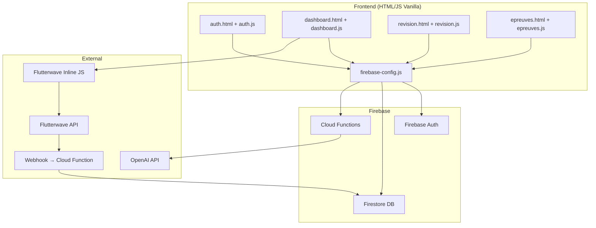
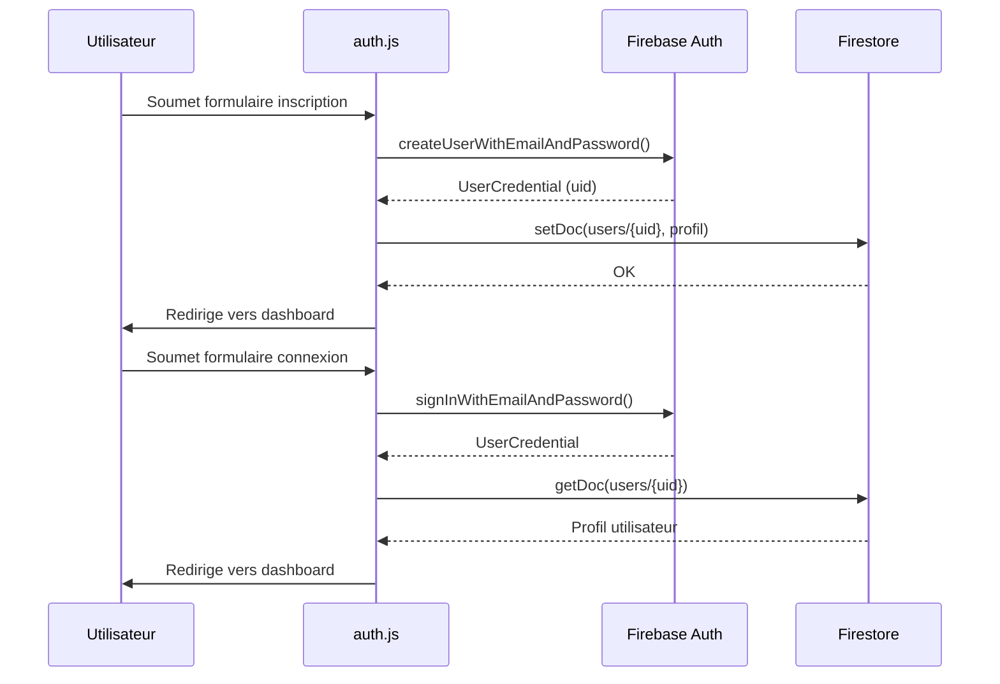
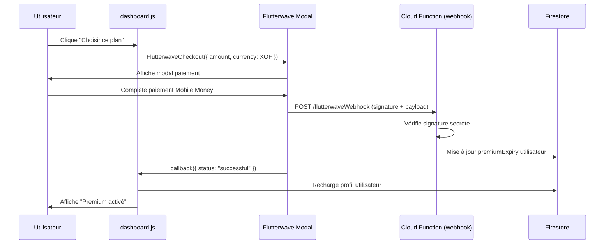
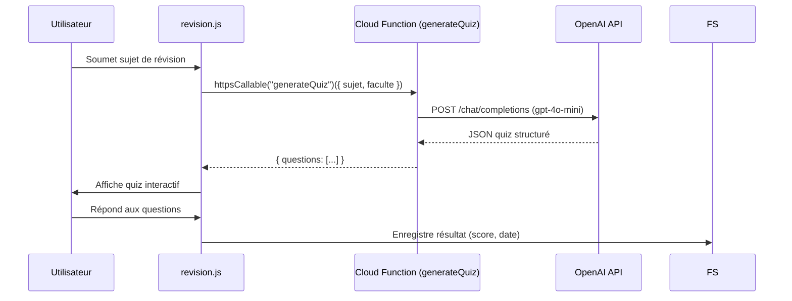

# Design Document — Campusly MVP Réel

## Overview

Ce document décrit l'architecture technique pour migrer Campusly d'un frontend statique avec localStorage vers un MVP de production. L'application reste une **Single Page Application (SPA) en HTML/CSS/JavaScript vanilla** (sans framework), enrichie de :

- **Firebase Authentication** pour l'auth réelle
- **Firestore** pour la base de données cloud
- **Firebase Cloud Functions** comme proxy backend sécurisé
- **Flutterwave Inline** pour les paiements Mobile Money / carte
- **OpenAI GPT-4o-mini** pour la génération de quiz

L'approche sans framework est maintenue pour rester cohérente avec le code existant et minimiser la complexité de déploiement.

---

## Architecture



### Flux d'authentification



### Flux de paiement



### Flux quiz IA



---

## Components and Interfaces

### 1. `js/firebase-config.js` — Configuration Firebase

```javascript
// Initialise Firebase et exporte les instances
import { initializeApp } from "firebase/app";
import { getAuth } from "firebase/auth";
import { getFirestore } from "firebase/firestore";
import { getFunctions } from "firebase/functions";

const firebaseConfig = { /* variables d'env */ };
export const app = initializeApp(firebaseConfig);
export const auth = getAuth(app);
export const db = getFirestore(app);
export const functions = getFunctions(app);
```

Comme le projet est en vanilla JS sans bundler, on utilisera les **CDN ESM** de Firebase v10 via `<script type="module">`.

### 2. `js/auth.js` — Authentification Firebase

Remplace le système localStorage actuel.

**Fonctions clés :**
- `handleRegister(e)` → `createUserWithEmailAndPassword()` + `setDoc()` dans Firestore
- `handleLogin(e)` → `signInWithEmailAndPassword()`
- `handleLogout()` → `signOut()`
- `onAuthStateChanged(auth, callback)` → Garde de route sur toutes les pages protégées

**Email Firebase :** Comme Firebase Auth requiert un email, on génère un email fictif à partir du matricule : `{matricule.toLowerCase()}@campusly.uac.bj`. Le matricule reste l'identifiant affiché.

### 3. `js/firestore.js` — Couche d'accès aux données

Module centralisé pour toutes les opérations Firestore.

**Collections :**
- `users/{uid}` — Profils utilisateurs
- `epreuves/{id}` — Documents d'épreuves
- `transactions/{id}` — Historique des paiements
- `users/{uid}/history/{id}` — Historique téléchargements (sous-collection)
- `users/{uid}/quizResults/{id}` — Résultats quiz (sous-collection)

**Fonctions clés :**
- `getUserProfile(uid)` → `getDoc(doc(db, "users", uid))`
- `updateUserPremium(uid, expiry)` → `updateDoc()`
- `getEpreuves(filters)` → `query()` avec `where()` chainés
- `saveQuizResult(uid, result)` → `addDoc()`
- `saveDownload(uid, epreuveId)` → `addDoc()`

### 4. `js/payment.js` — Intégration Flutterwave

Utilise **Flutterwave Inline** via CDN : `https://checkout.flutterwave.com/v3.js`

```javascript
function initFlutterwavePayment(plan, user) {
  FlutterwaveCheckout({
    public_key: FLUTTERWAVE_PUBLIC_KEY,
    tx_ref: `campusly-${Date.now()}-${user.uid}`,
    amount: plan.price,
    currency: "XOF",
    payment_options: "mobilemoneyfrancophone,card",
    customer: {
      email: user.email,
      name: `${user.prenom} ${user.nom}`,
    },
    customizations: {
      title: "Campusly Premium",
      description: `Abonnement ${plan.label}`,
      logo: "/campusly/assets/logo.png.jpg",
    },
    callback: (response) => handlePaymentCallback(response, plan),
    onclose: () => showToast("Paiement annulé.", "info"),
  });
}
```

### 5. `functions/index.js` — Firebase Cloud Functions

Deux fonctions principales :

**`generateQuiz` (Callable Function) :**
- Reçoit `{ sujet, faculte, nbQuestions }`
- Vérifie l'authentification via `context.auth`
- Vérifie la limite quotidienne pour les non-premium
- Appelle OpenAI GPT-4o-mini avec un prompt structuré
- Retourne le JSON du quiz

**`flutterwaveWebhook` (HTTP Function) :**
- Reçoit le webhook Flutterwave
- Vérifie la signature `verif-hash`
- Met à jour `premiumExpiry` dans Firestore
- Enregistre la transaction

### 6. `js/revision.js` — Interface Quiz IA

Mise à jour pour appeler la Cloud Function :

```javascript
import { httpsCallable } from "firebase/functions";

async function generateQuiz(sujet) {
  const generateQuizFn = httpsCallable(functions, "generateQuiz");
  const result = await generateQuizFn({ sujet, faculte: user.faculte });
  return result.data.questions;
}
```

---

## Data Models

### Collection `users`

```javascript
{
  uid: string,           // Firebase Auth UID
  matricule: string,     // "UAC2024001"
  prenom: string,
  nom: string,
  email: string,         // "{matricule}@campusly.uac.bj"
  faculte: string,       // "FAST"
  departement: string,
  isPremium: boolean,
  premiumExpiry: Timestamp | null,
  quizCountToday: number,       // Compteur quiz gratuits
  quizCountResetDate: Timestamp, // Date de reset du compteur
  createdAt: Timestamp,
}
```

### Collection `epreuves`

```javascript
{
  id: string,
  titre: string,
  faculte: string,
  departement: string,
  semestre: string,      // "S1", "S2", "S3"...
  annee: string,         // "2023"
  type: string,          // "examen" | "partiel" | "rattrapage"
  isPremium: boolean,
  fileUrl: string,       // URL Firebase Storage ou lien externe
  dateAjout: Timestamp,
}
```

### Collection `transactions`

```javascript
{
  userId: string,
  txRef: string,         // Référence Flutterwave
  amount: number,
  currency: string,      // "XOF"
  plan: string,          // "week1" | "month1"
  status: string,        // "success" | "failed" | "pending"
  flwRef: string,        // Référence interne Flutterwave
  createdAt: Timestamp,
}
```

### Structure Quiz (retour OpenAI)

```javascript
{
  questions: [
    {
      question: string,
      options: [string, string, string, string],
      reponseCorrecte: number,  // index 0-3
      explication: string,
    }
  ]
}
```

---

## Correctness Properties

*Une propriété est une caractéristique ou un comportement qui doit être vrai pour toutes les exécutions valides d'un système — essentiellement, un énoncé formel sur ce que le système doit faire. Les propriétés servent de pont entre les spécifications lisibles par l'homme et les garanties de correction vérifiables par machine.*

### Property 1 : Unicité du matricule à l'inscription

*Pour tout* matricule déjà enregistré dans Firestore, une tentative d'inscription avec ce même matricule doit être rejetée et aucun nouveau document utilisateur ne doit être créé.

**Validates: Requirements 1.2**

---

### Property 2 : Cohérence du statut premium après paiement

*Pour tout* utilisateur et tout paiement Flutterwave confirmé avec succès, après traitement du webhook, le champ `premiumExpiry` de l'utilisateur dans Firestore doit être une date strictement supérieure à la date actuelle.

**Validates: Requirements 4.2**

---

### Property 3 : Isolation des données utilisateur (règles Firestore)

*Pour tout* utilisateur authentifié A et tout utilisateur B (A ≠ B), A ne doit pas pouvoir lire ni modifier le document `users/{B.uid}`.

**Validates: Requirements 2.4, 6.2**

---

### Property 4 : Structure valide du quiz généré par l'IA

*Pour tout* sujet de révision soumis, le quiz retourné par la Cloud Function doit contenir entre 5 et 10 questions, chaque question ayant exactement 4 options, un index `reponseCorrecte` entre 0 et 3, et une explication non vide.

**Validates: Requirements 5.1, 5.2**

---

### Property 5 : Limite quotidienne des quiz gratuits

*Pour tout* utilisateur non-premium ayant déjà effectué 3 quiz dans la journée, toute tentative de génération d'un quiz supplémentaire doit être rejetée par la Cloud Function.

**Validates: Requirements 5.6**

---

### Property 6 : Accès premium aux épreuves

*Pour tout* utilisateur non-premium, toute tentative d'accès à une épreuve marquée `isPremium: true` doit être bloquée côté client et côté règles Firestore.

**Validates: Requirements 3.3**

---

### Property 7 : Intégrité des transactions enregistrées

*Pour tout* paiement traité (succès ou échec), un document de transaction doit être créé dans Firestore avec un `txRef` unique, un `status` correspondant au résultat réel, et un `userId` valide.

**Validates: Requirements 4.6**

---

## Error Handling

| Scénario | Comportement attendu |
|---|---|
| Email/matricule déjà utilisé | Message : "Un compte existe déjà pour ce matricule." |
| Mot de passe incorrect | Message générique sans révéler le champ en erreur |
| Paiement Flutterwave échoué | Toast d'erreur, statut premium inchangé |
| API OpenAI indisponible | Message : "Service IA temporairement indisponible. Réessayez." |
| Quota quiz gratuit atteint | Message : "Limite de 3 quiz gratuits atteinte. Passez Premium." |
| Firestore hors ligne | Utilisation du cache offline Firebase, indicateur visuel |
| Token Firebase expiré | `onAuthStateChanged` détecte la déconnexion, redirige vers auth |

---

## Testing Strategy

### Approche duale : Tests unitaires + Tests basés sur les propriétés

**Tests unitaires** (Jest) — pour les cas spécifiques et les cas limites :
- Validation du format matricule
- Génération de l'email fictif depuis le matricule
- Parsing et validation de la structure JSON du quiz
- Calcul de la date d'expiration premium selon le plan choisi
- Vérification de la signature webhook Flutterwave

**Tests basés sur les propriétés** (fast-check) — pour les propriétés universelles :
- Chaque propriété listée ci-dessus correspond à un test de propriété
- Minimum 100 itérations par test
- Les générateurs produisent des données aléatoires réalistes (matricules, sujets, montants)

**Configuration des tests de propriétés :**

```javascript
// Exemple — Property 4 : Structure valide du quiz
// Feature: campusly-mvp, Property 4: Structure valide du quiz généré par l'IA
fc.assert(
  fc.asyncProperty(fc.string({ minLength: 3 }), async (sujet) => {
    const quiz = await generateQuizMock(sujet);
    return (
      quiz.questions.length >= 5 &&
      quiz.questions.length <= 10 &&
      quiz.questions.every(q =>
        q.options.length === 4 &&
        q.reponseCorrecte >= 0 &&
        q.reponseCorrecte <= 3 &&
        q.explication.length > 0
      )
    );
  }),
  { numRuns: 100 }
);
```

**Bibliothèque PBT choisie :** [fast-check](https://fast-check.io/) — compatible JavaScript/Node.js, bien maintenue, idéale pour tester les Cloud Functions.

**Tag format :** `// Feature: campusly-mvp, Property {N}: {titre}`

### Couverture cible

| Composant | Tests unitaires | Tests propriétés |
|---|---|---|
| auth.js (validation) | ✓ | ✓ (Property 1) |
| firestore.js (règles) | ✓ | ✓ (Property 3, 6) |
| payment.js (webhook) | ✓ | ✓ (Property 2, 7) |
| Cloud Function quiz | ✓ | ✓ (Property 4, 5) |
